# Dolce Vita Venice Blog

A blog about food and drink in Venice, Italy. Venice is a magical city with 118 islands, 400 bridges and 170 canals. Venice is also renowned for its distinctive cuisine, influenced by its geography, traditions, and local produce. Exploring its food scene through a blog allows readers to:

  - Cultural Exploration: Venice's cuisine reflects its history and diverse cultural influences. Writing about its food and drink provides insights into the city's heritage, traditions, and the stories behind its culinary specialties.

  - Unique Culinary Experience: Venice offers many unique dishes and drinks that may not be found elsewhere. Sharing these through a blog allows readers to experience them vicariously and potentially try them if they visit.

  - Local Insights: Exploring the food and drink of Venice involves engaging with locals, chefs, and artisans. It provides an opportunity to share their stories, techniques, and passion for their craft.

  - Travel and Gastronomy Fusion: For many, travel and food are linked. A blog about Venice's food and drink merges the joys of travel with the pleasures of food, offering a virtual journey for those unable to visit in person.

  - Practical Information: Practical tips on where to find the best food spots, how to navigate Venice's culinary scene, and recommendations for authentic experiences.

    - This blog aims to take the beauty of Venice and combine it with the flavours of Venice, so that blog posts reflect the Italian ethos of good food and drink. Blog users can interact with the content by adding comments or posts. Or alternatively just read about Venice's food and drink culture.

    - This blog is made for site users that may be interested in a visit to Venice. Time is valuable during a break away, site users can get to know about good food and drink in Venice. Also if the site user is a resident they can read about the latest food and drink news happening in their city. The site user can also give back, by leaving comments of their real life experiences based on blog posts. They can also add their own incredible food and drink finds.

    - This blog aims to provide users practical tips and interesting information.

## Portfolio Project 4

P4 Project for the Code Institute

[Live Site](https://dolce-vita-blog-d2c3285a70fd.herokuapp.com/)

[Website Mock-up](https://ui.dev/amiresponsive?url=https://dolce-vita-blog-d2c3285a70fd.herokuapp.com/)

## Table of contents

- [Dolce Vita Venice Blog](#dolce-vita-venice-blog)
  - [Portfolio Project 4](#portfolio-project-4)
  - [Table of contents](#table-of-contents)
  - [UX Design](#ux-design)
    - [User stories](#user-stories)
    - [Data Model](#data-model)
    - [Site plan](#site-plan)
  - [Data Security](#data-security)
  - [Meta data](#meta-data)
    - [Design](#design)
  - [Features](#features)
    - [Future Features](#future-features)
  - [Technologies Used](#technologies-used)
    - [Languages Used](#languages-used)
    - [Frameworks and Libraries Used](#frameworks-and-libraries-used)
    - [Software and Web Applications Used](#software-and-web-applications-used)
  - [Testing](#testing)
    - [Browser Testing](#browser-testing)
    - [Validator Testing](#validator-testing)
      - [W3C Markup Validator](#w3c-markup-validator)
      - [W3C CSS Validator](#w3c-css-validator)
      - [JSHint](#jshint)
      - [PEP8 Online](#pep8-online)
      - [Lighthouse](#lighthouse)
      - [Django testing tools](#django-testing-tools)
    - [Coverage tests](#coverage-tests)
    - [User Stories testing](#user-stories-testing)
    - [Further Testing](#further-testing)
    - [Solved bugs](#solved-bugs)
    - [Unresolved bugs](#unresolved-bugs)
  - [Deployment](#deployment)
  - [Pre-deployment](#pre-deployment)
  - [Credits](#credits)
    - [Acknowledgements](#acknowledgements)

## UX Design

The purpose of this blog is to offer user-generated content that is authentic and offers readers genuine value for their time visiting the site.

It is intended to attract site users to read and join in with all things food and drink related in Venice, Italy.

The primary user of the site will be English speaking users interested in food and drink in general, with a focus on Venice and therefore Italian regional specialities.

The aim of the site is to create a user-friendly and engaging food and drink blog. It is therefore essential to attract and retain readers. Here are some user experience (UX) principles included in this food and drink blog:

- Clean and Responsive Design:
Ensure the blog has a clean and visually appealing design that is easy on the eyes.
Use a responsive design that adapts to various screen sizes and devices, including smartphones and tablets.

- Clear Navigation:
Implement an intuitive and organised menu structure. Categories like "Restaurants," "Bars," "Food," and "Drinks" help users quickly find what they're looking for.
Clear and descriptive labels are important for the navbar.

- High-Quality Imagery:
High-resolution images of food and drink to entice readers.

- Readable Typography:
Appropriate fonts and font sizes, line spacing, and contrast for readability.

- Engaging Content:
Compelling and informative articles with clear headings and subheadings.

- Mobile Optimisation:
Blog can be viewed on various mobile devices to ensure a seamless mobile experience.
Mobile-friendly navigation menus and buttons.

- Social Sharing and Comments:
Easy for readers to share the content on social media platforms.
Enable comments to foster community engagement and discussions.

- Accessibility:
Blog is accessible to all users, including those with disabilities. The use of alt text for images. Text color chosen contrasts well to the background color to improve user visibility.

- Security Measures:
Security measures to protect the blog and user data, including CSRF tokens to prevent Cross-Site Request Forgery attacks.

- Feedback Mechanism:
Contact information so readers can reach out with questions or suggestions. Comments section to extend the conversation beyond the blog post. Author bio to intereact further with the writer of the blog post.

- Branding and Personality:
Unique brand identity for the blog that reflects the style and personality of Venice.
Consistant use of branding elements such as logos and colour schemes.

__Project Aims__

The primary goal for this project is to create a food and drink blog, with full CRUD functionality to registered users so that they can Create, Read, Update and Delete both blog posts and comments. The site user has full control over their posts and comments.

__Project Strategy__

Using An Agile methodology, this project was planned using a Kanban board in the GitHub Project with linked Issues based on a saved template. To cover the aims of this project, a total of 27 User Stories were planned, each with their own acceptance criterias and tasks to complete. A total of 23 User Stories were completed working on this project.

For more information: [Kanban Board - User Stories](https://github.com/users/estii20/projects/9/archive)

### User stories

| User Story | Title | Must Have | Should Have | Could Have |
| --- | --- | --- | --- | --- |
| US1. | As a Site User I can click on a post so that I can read the full text. | x | | |
| US2. | As a Site User / Admin I can view the number of likes on each post so that I can see which is the most popular. | x | | |
| US3. | As a Site User I can view a list of posts so that I can select one to read. | x | | |
| US4. | As a Site Admin I can create draft posts so that I can finish writing the content later. | x | | |
| US5. | As a Site Admin I can approve or disapprove comments so that I can filter out unacceptable comments. | x | | |
| US6. | As a Site Admin I can create, read, update and delete posts so that I can manage my blog content. | x | | |
| US7. | As a Site User / Admin I can view comments on an individual post so that I can read the conversation. | x | | |
| US8. | As a Site User I can register an account so that I can comment and like. | x | | |
| US9. | As a Site User I can leave comments on a post so that I can be involved in the conversation. | x | | |
| US10. | As a Site User I can edit a post so that I can update my blog post. |  | x| |
| US11. | As a Site User I can add a post so that I can engage with the blog. |  | x | |
| US12. | As a Site User I can delete a post so that I can remove invalid blog posts. |  | x | |
| US13. | As a Site User I want to share posts to my social media accounts so that I can repost posts on other sites. |  | x | |
| US14. | As a Site User I can see and choose a category of blog post so that I can easily find relevant posts. |  | x | |
| US15. | As a Site User I can see the author bio of a blog post so that I can read about their background information. |  | x | |
| US16. | As a Site User I want to be able to delete a comment so that I can remove comments from posts. |  | x | |
| US17. | As a Site User I want to be able to edit a comment so that I can amend typos from comments. |  | x | |
| US18. | As a Site Admin I want to be able to display an about page so that the user can know who/what the blog is for/about | x | | |
| US19. | As a Site User I want to be able to sign up for a newsletter so that I can keep up-to-date without logging into the site. | | | x  |
| US20. | As a Site User I want to be able to search for posts so that I can find posts that interest me. |  | | x |
| US21. | As a Site User I want to see success messages so that I know when an action has been taken. | x | | |
| US22. | As a Site User / Admin I want to show the read time of a post so that visitors can click on posts that they have time to read. |  | x | |
| US23. | As a Site User I want to be able to read at night time using a dark toggle button so that it is easier to read. | | | x |
| US24. | As a Site User / Admin I want to be able to contact the site owner so that it is possible to offer feedback and ask for information. | x | | |
| US25. | As a Site User/ Admin I want to be able to view posts with the most recent post featured first so that it is possible to get the latest blog post. | x | | |
| US26. | As a Site User / Admin I want to be able to see logged-in user name so that I know when I am logged into the site. |  | x | |
| US27. | As a Site User I want to be able to save my user details such as my author bio so that I can add it to a post without rewriting it each post. | | | x |

### Data Model

This project is hosted on Heroku and the database used is Elephant PostgreSQL. Cloudinary is used to store all blog images.

As part of the project planning phase a model design of the site structure has been designed to understand the main entities.
- The Post Model is used by the Comment Model to ensure the right blog post is being commented on. The diagram also highlights that one blog post can have many comments.
- The key component in this relationship is the user. The default Django User Model is used.
- One user can add many likes throughout the site.
- There are six categories created within the Django Admin panel. These are displayed to the user as a dropdown field choice when adding a blog post.
- The model shows the following relationships:
    - One blog post can have one author (User)
    - One blog post can have one category
    - One blog post can have many comments
    - One blog post can have many likes
    - One user can add one log post like
    - One user can add many comments to one blog post

Diagram - Post, Comment, Category, and Django admin.

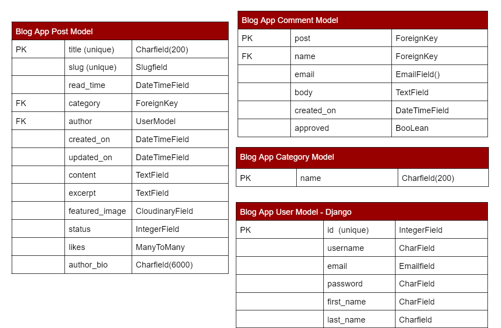

### Site plan

Structure of the site made in lucid chart. Details access to site features based on authentication of user.

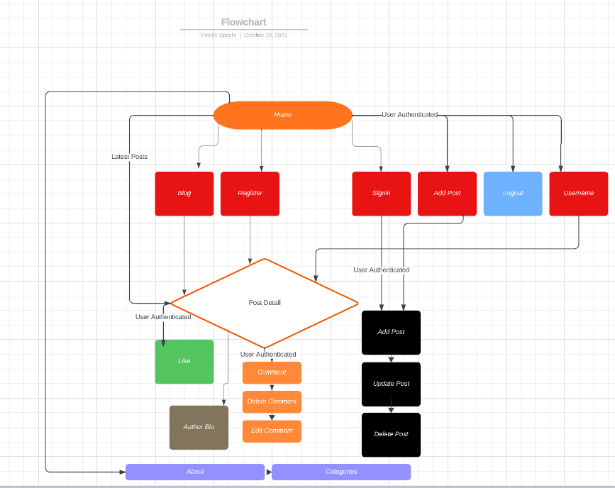

## Data Security

The following steps were taken to ensure security of data of the user:
- An env.py file to store key variables for accessing secure environments.
- A gitignore file has been incorporated to ensure the env.py file is never committed to production, so these key variables are not committed.
- Variables stored within the Config Variables in Heroku to ensure Codeanywhere and Heroku can update securely.
- Cross Site Request Forgery (CSRF) tokens have been applied to all HTML Forms. Their application provides protection from malicious attacks.
- Django's inbuilt User Authentication has been applied to several key areas to ensure only approved Users can Add, Comment, Like blog posts. A further layer of security has been applied to ensure the ability to Edit or Delete a blog post/comment can only be performed by the User who has authored the blog post or comment.

## Meta data

Meta data is included within the HTML head element to increase the traffic to the website.

### Design

__Skeleton__

Webpage and mobile version made using [Balsamiq](https://balsamiq.cloud/skgv95c/pk5rjyb).

Login / Register Page

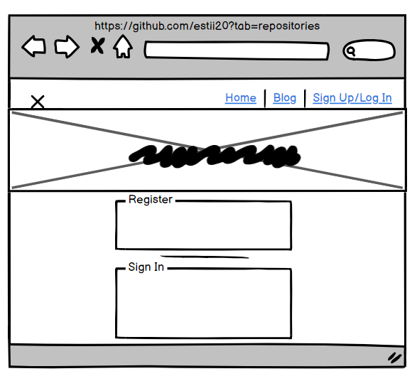

Homepage

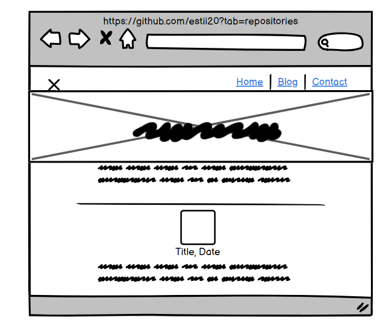

Post Detail page

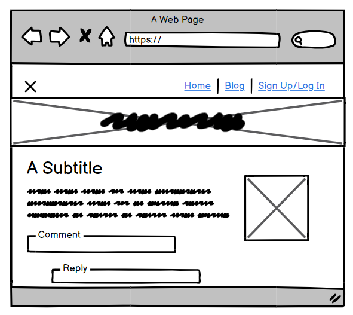

Mobile version

Login page

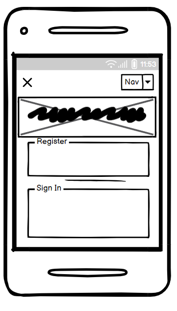

Homepage

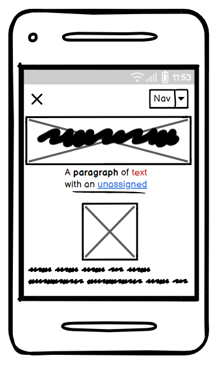

Post Detail page

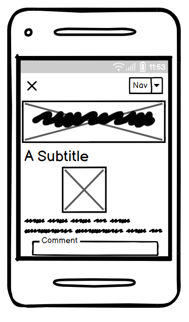

__Surface__

To create a clear visual guide to the site user.

__Color Palette__

To create a cohesive site look, using the colors from the hero images to reflect throughout the site.

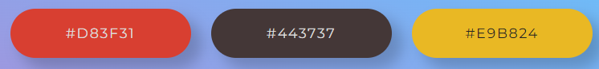

- Pagination color orange `#E9B824`, `rgb(233, 184, 36)`
- Title, Blog card shadow, button color deep red `#D83F31`, `rgb(216, 63, 49)`
- Body background color white `#FFFFFF`
- Body text color charcoal `3F3F3F`
- Blockquote color red `rgb(216, 63, 49, 0.7)`
- Blog card border shade with varying opacity `rgba(216, 63, 49)`
- Page links gray `#443737` hover `#D83F31`
- Author Bio form orange with opcacity `rgba(255, 77, 0, 0.1)`
- Footer background color dark gray with opactiy `rgb(39, 33, 33, 0.6)`
- Social share buttons blue Facebook `#3B5998`, green WhatsApp `#25D366`, black for X (Twitter) `#000000`
- Buttons `#D83F31`

[Colorspace](https://mycolor.space/) used to check the palette works together.

__Fonts__

The fonts chosen reflects the rich and delicious nature of Italian cuisine whilst maintaining readability.

- Libre Bodoni: Libre Bodoni is a timeless serif font that offers a sense of tradition.
- Pacifico: Pacifico is a fun and informal script font used for blog titles or special callouts.
- EB Garamond: EB Garamond is a classic serif font which is elegant and sophisticated.
- Sans-serif used as an alternative font.

- Fonts imported from [Google Fonts](https://fonts.google.com/).
- [Font Awesome](https://fontawesome.com/) used to add visual cues to the logo, headings, contact information, and social media links.
- Used [fontjoy](https://fontjoy.com/) to find the font for the logo and headings.

## Features

__Homepage__

- Header with Logo and Navigation Links. Logged in user navbar can Add Post, Logout, see their Username. Not logged in user can Sign in, and Register.
- Brief description of the blog content so that site visitors can know what the blog is about.
- Latest blog posts, paginated by 6 posts per page.
- Category link to relevant category group on blog post card above the blog title.
- Blog post card footer details the read time of the post, number of likes and date created on.
- Blog post card with default picture of restaurant table in Venice or alternative uploaded image reflecting the blog content.
- Link to read more which goes to the post_detail.html page.
- Footer with associated social media links, about page link, categories links and contact information.

__Hero Image__

Bootstrap fully responsive carousel - three rolling images of Venice. Overlay text informs users about what the blog is about.

__Navbar__

The navbar is present on all pages of the site. It is fully responsive, on smaller devices the navbar will collapse and the navigation links are accessed using a "hamburger menu".
Navbar Logo is font awesome icon `fa-solid fa-wine-glass`.

- Logged-in navbar left
  - Home
  - Add Post
  - Signout
- Logged-in navbar right
  - Username with Font Awesome icon `fa-regular fa-user`
- Not logged-in user
  - Home
  - Register
  - Signin

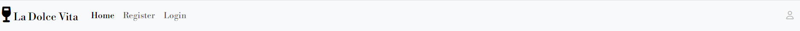

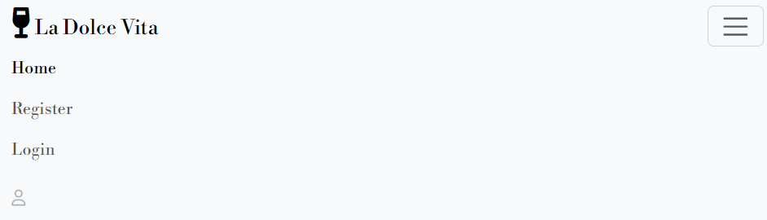

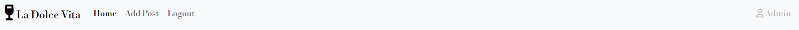

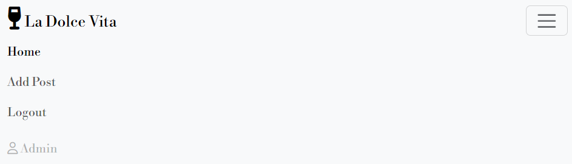

__Jumbotron Header and Blockquote__

Easy to read information about the blog purpose and use. Font awesome icons used to show the main features of the blog.

- Eat Venice `fa-solid fa-pizza-slice`
- Drink Venice `fa-solid fa-wine-glass`
- Share your stories `fa-solid fa-share`

Italian quote to give the feel and branding of the site.

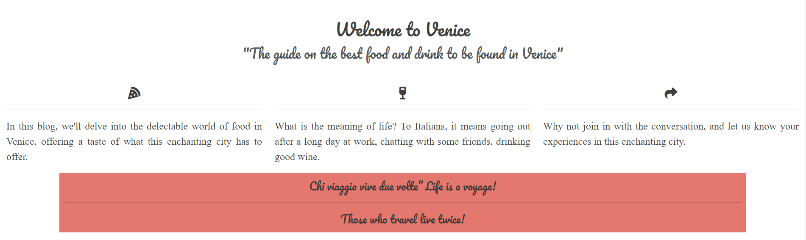

__Blog Card__

Bootsrap card layout. CSS style added to reflect the look of the blog site.

- Category Title and link
- Blog Title
- Featured Image
- Excerpt
- Read more link
- Card footer with date created, number of likes and readtime of post

__Pagination__

Bootstrap pagination with CSS style added to reflect the look of the blog site. Paginate blog posts by six per page.

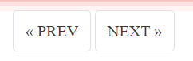

__Footer__

About link to about.html so that visitors can know more about the blog site.

Non-logged in user can see links to Register or Login.

Links to the sites main social media are used and are centered left within the footer.
The links are colored to compliment the Logo and headers.
Links have been given aria labels to help with user accessibility, they open in a separate window so the user can navigate easily between sites.

Categories menu links so that users can directly visit posts related to a particular genre.

Contact information so that users can get in touch with feedback and suggestions.
- Email `fa fa-envelope-o mr-3`

Copyright of Unsplash.com where images have been used.

Blog purpose as educational only website.

Logged-in/Registered user:

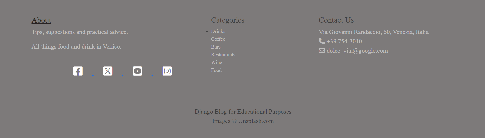

Not logged-in/Registered user:

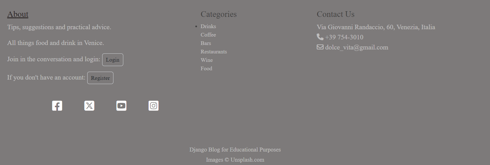

Mobile version:

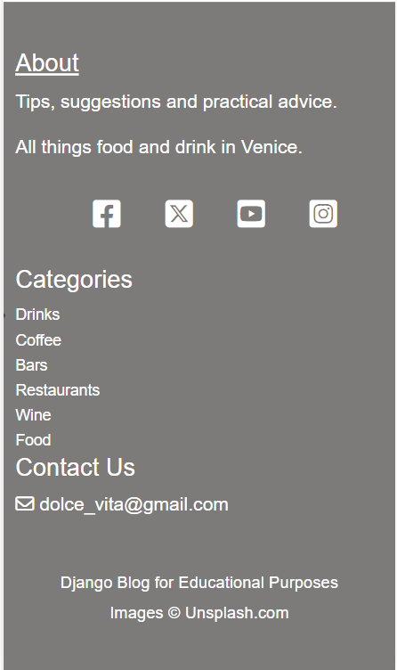

__Post Detail page__

When a user clicks on a blog post, they are brought to the Post detail page. The user is shown the whole post with a commenting feature below. The user will be able to interact with the content depending on user status.

The following information will be presented to the user:

- Header with Logo and Navigation Links
- Blog Title
- Read Time
- Post Author `fa-regular fa-user`
- Created-on Date `fa-regular fa-clock`
- Featured image
- Blog content
- Author Bio - if added
- Option if logged-in user to edit/delete post if post author.
  - Delete: `fa-solid fa-delete`
  - Update: `fa-regular fa-pen-to-square`
- Likes - if logged in like functionality:
  - Unclicked `fa-regular fa-thumbs-up`
  - Clicked: `fa-solid fa-thumbs-up`
  - Counts the number of likes
- Social media share buttons - Facebook, X and WhatsApp
- Comments - Edit/Delete comments if user if authenticated and comment author. Order the comments by date ascending.
  - Delete: `fa-solid fa-delete`
  - Update: `fa-regular fa-pen-to-square`
- Add Comments form - if user is logged-in. Alternatively, a reminder to users to login or register in order to comment.
- Footer with links to the Social Media platforms, About page, Categories and Contact Information.

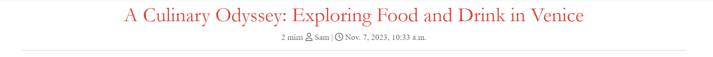

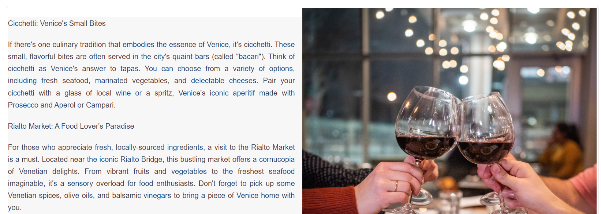

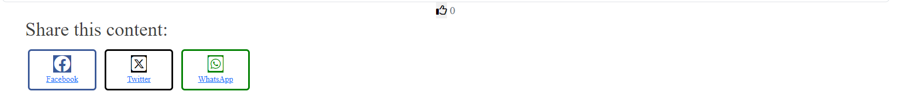

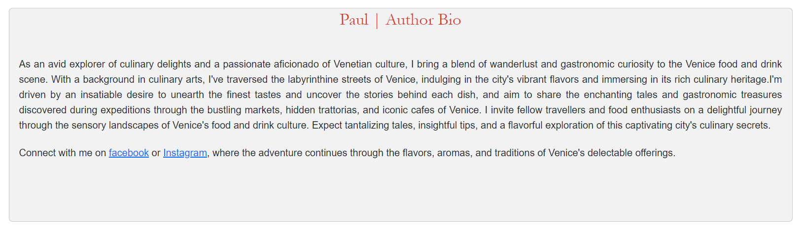

Features dependent on user status:

- Comment - The comment form is presented to the user and the user can comment on the post. Once the user clicks on Submit, the comment is added to the list of comments once published. 

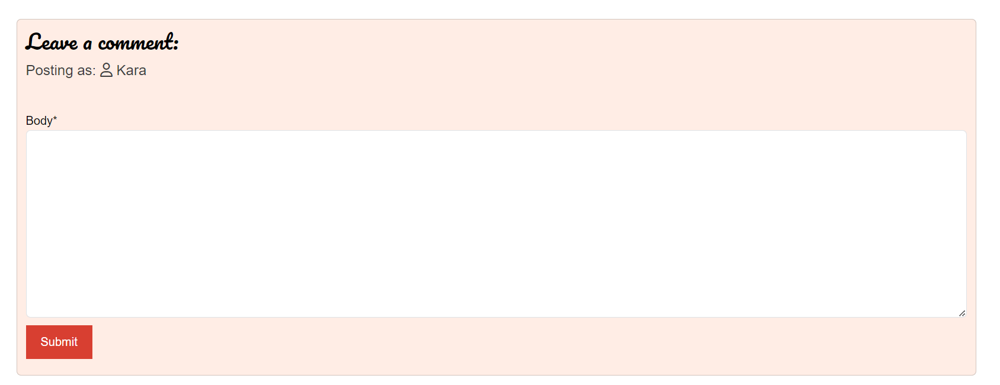

If not logged-in user sees message to login or register.

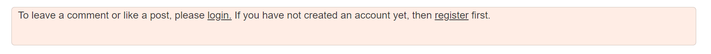

- Likes - Counts the number of post likes if user is logged-in.

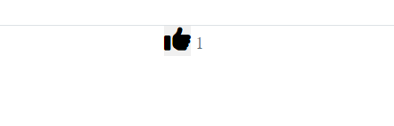
  
- Edit Post/Delete Post - The post author will have full CRUD functionality. They can update or delete their posts.

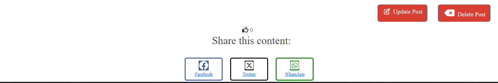

Edit Post page - prepopulated for ease of editing

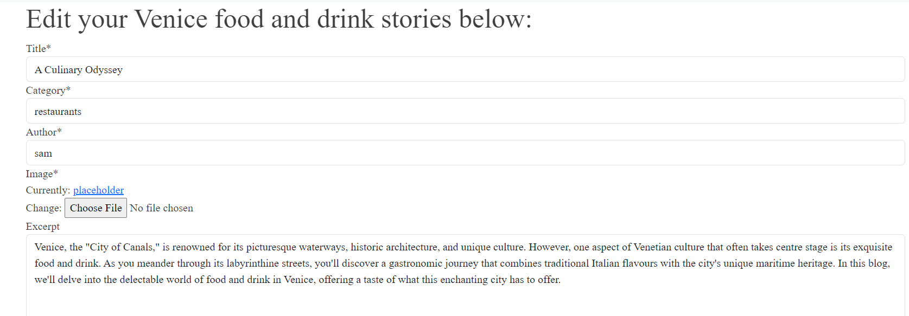

- Edit Comment/Delete Comment - The comment author will have full CRUD functionality. They can update or delete their comments.

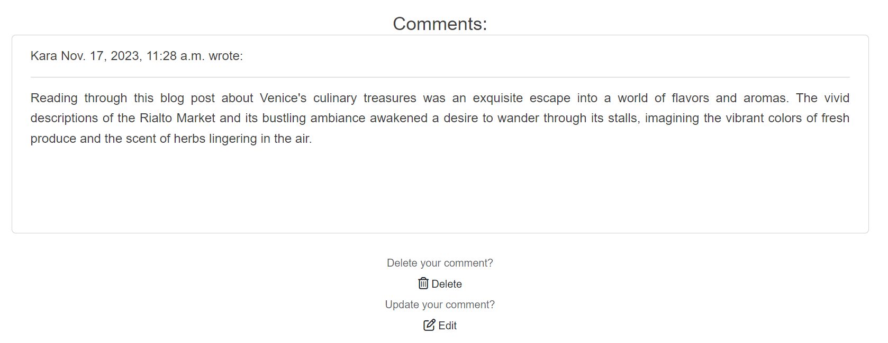

- Error forbidden message if not authorised to delete/edit comments and/or posts.

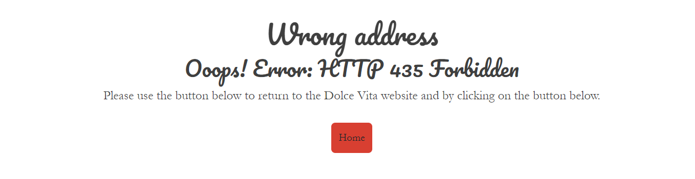

__Add Post page__

This feature is only available if a user chooses to register to the site and can be accessed using the provided navbar link. On the Add post page, the user will be able to share their food and drink experience and add an image to their post. The form uses the SummernoteWidget for ease of editing and writing.

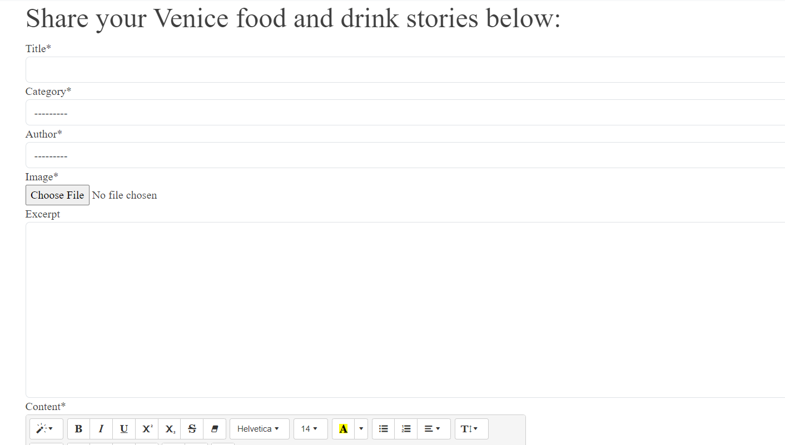

The following fields are requested to be completed when submitting a post:

- Title - required field.
- Category - a dropdown list of categories available to select. Category options are quite broad so that all posts have a category that would suit their post.
- Featured Image - not a required field as a placeholder image will feature if one not added. The default image is of a restaurant table overlooking Venice.
- Blog Content - SummernoteWidget allows the user to add their story/experience of food and drink related posts about Venice. The user can add other images, fonts, and word document features to really individualise their post content.
- Author Bio - not required field. SummernoteWidget allows the user to add their author bio and any images they wish to upload with full word functionailty.

When all the required fields are completed and the user clicks on submit, their post will be automatically added to the list of posts and the user is redirected to their blog post once published.

__Update Post page__

The post author can update their blog post using the Post edit page, which can easily be accessed by clicking on the update button at the bottom of the post_detail.html page. The post author will have full control over their posts and can easily make changes or correct any typos in their post after it’s been published.

The post edit page has all the fields pre-populated, so that the user can easily amend the post.

Once the edit post form is submitted, the blog post will immediately be updated and the user can view the post.

__Delete Post page__

- User is the post author:
The post author will have full CRUD functionality over their posts. They can click on the delete post button and then be directed to the post_delete.html page.
Delete this post? - The user can confirm to delete their post or cancel and return to the post.

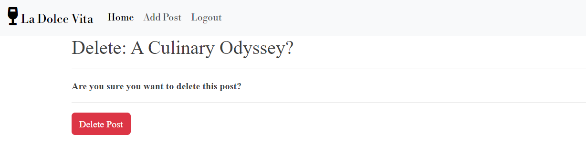

__Update Comment page__

The comment author will be able to edit their comment using the comment_edit.html page, which can easily be accessed by clicking on the update button of their comment. The comment author will have full control over their comments and can easily make changes or correct any mistakes in their comment after it’s been published.

The comment edit form has the comment pre-populated so that the author can easily amend their comment.

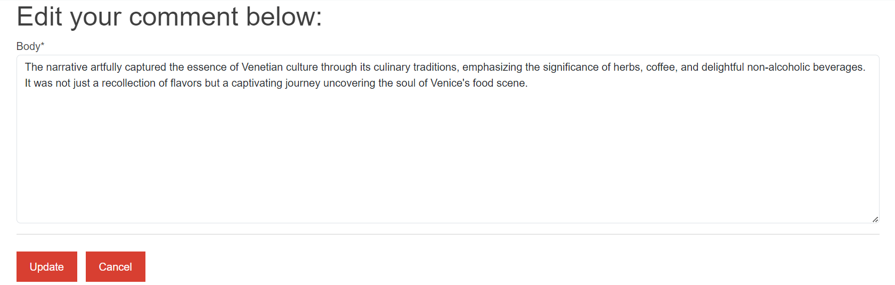

Once the comment is finalised and submitted, the comment will immediately be updated.

__Delete Comment page__

- User is the comment author:
The post author will have full CRUD functionality over their comments. They can click on the delete comment button and then be directed to the comment_delete.html page.
Delete this comment? - The user can confirm to delete their comment.

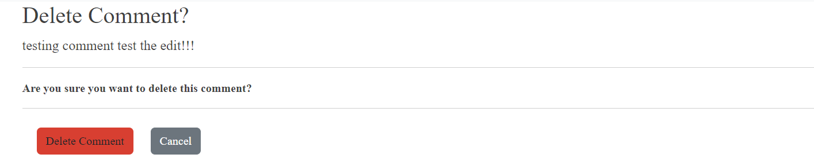

__Login page__

User CRUD functionality on posts and comments, or the ability to like/unlike a post, requires users to login to the site.
The Login page can be accessed:

- Navbar link - site-wide
- Login link, in the Comment section on the Post Detail page
- In the Footer section on the homepage

The user needs to enter the following information:

- Valid username
- Correct password

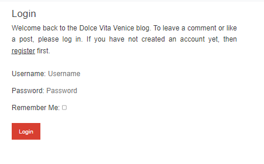

If user exists:

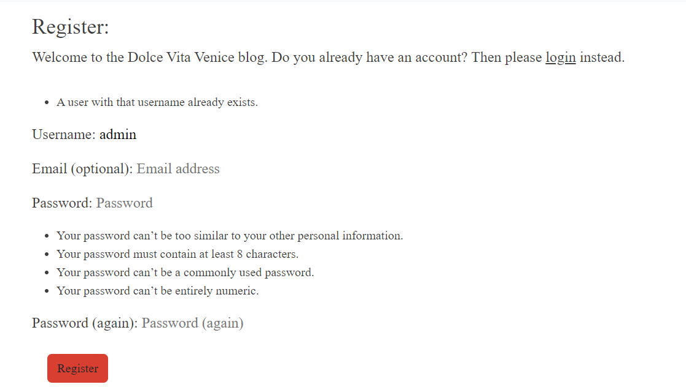

__Register page__

To fully use the site features, a user is required to register and login.
Unregistered users will be able to access the Register page:

- Navbar link - site-wide
- Register link, in the Footer section on the homepage
- Register link, in the Comment section on the Post Detail page

A new account can be easily created. The user needs to provide the following information:

- Username - must be unique
- E-mail - optional
- Password - entered twice
  
Once all fields are entered correctly, the user clicks on register and new account is automatically created and the user is redirected to the homepage.

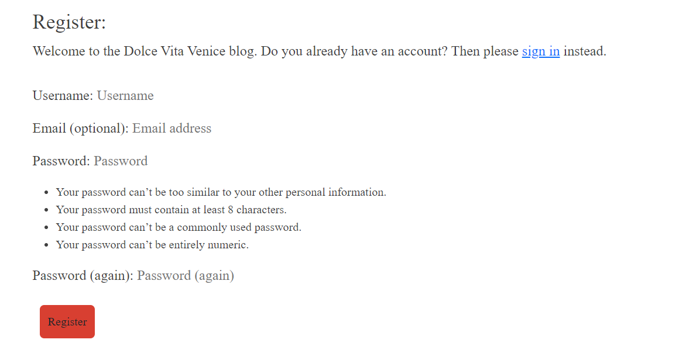

__Logout page__

Users enter a correct username with a matching password and clicks on Login, they are logged in and redirected to the homepage.

The Logout page can be accessed in the navbar link when a user is logged in. When the user clicks on Logout, they are directly logged out of their account and redirected to the homepage. 

__About page__

A brief description of the blog and what it is about. If not logged in as a user the page invites the user to either register or login. Also they are encouraged to get in touch if they want further information.

About.html logged-in

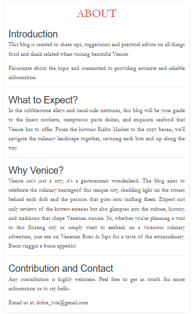

About.html not registered or logged-in user

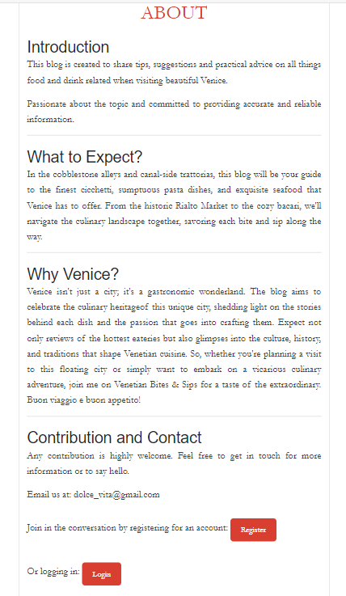

__Category page__

Post list by category - This page shows a list of blog posts by date created and by category. The user can select the full blog post by clicking on the link to read more. If there is no posts in a category, the user sees "sorry no posts in this category".

Bootsrap card layout. CSS style added to reflect the look of the blog site.

- Category Title and link
- Blog Title
- Featured Image
- Excerpt
- Read more link
- Card footer with date created, number of likes and readtime of post

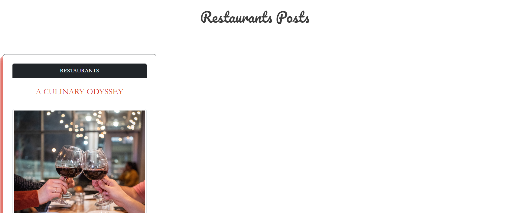

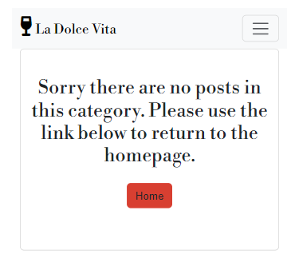

__Django Admin page__

To manage the blog content, a superuser account was created. A superuser can administer the site. The Admin page is accessed by logging in to the /admin URL with the superuser account username and password.
From the admin panel, the superuser will be able to delete and approve a specific post, comment or user. This functionality is necessary to maintain the blog and remove unwanted content. Also, a superuser can create post-drafts that can be published at a later time.

Sign-in:
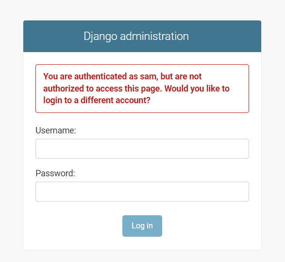

Admin:
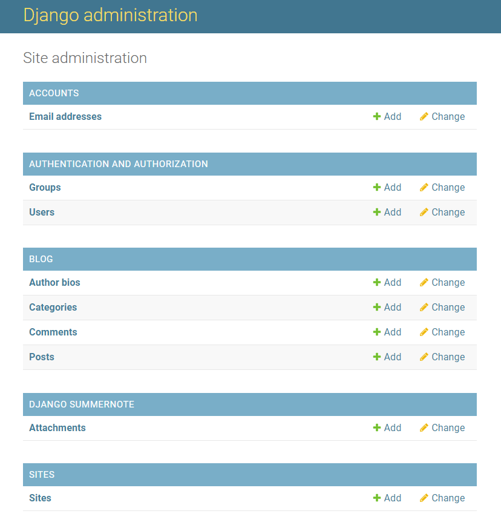

Publish Post:
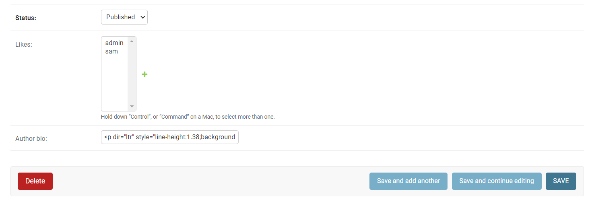

Post:
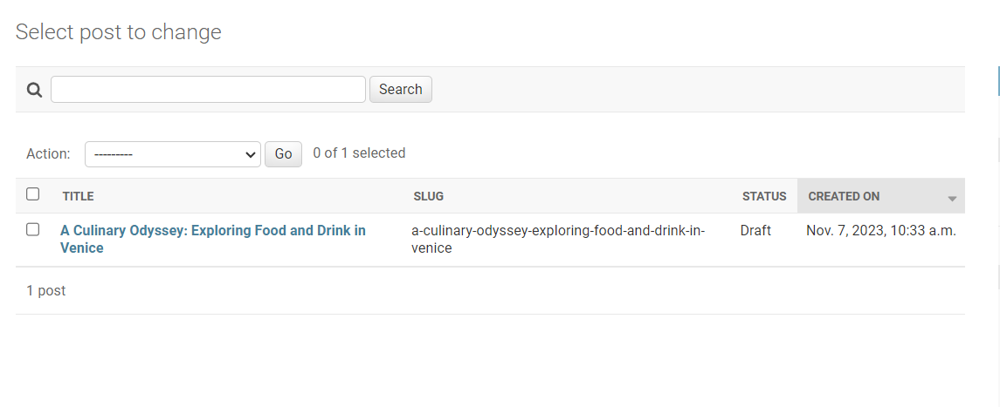

Comments:
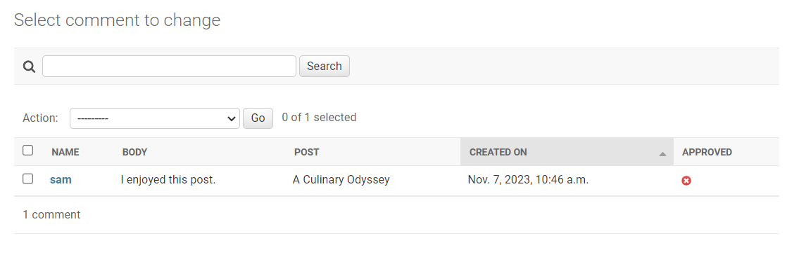

__Additional Features__

Messages are  displayed to the user as feedback when certain actions are completed. The message will appear at the top of the screen and after 2.5 seconds it will be automatically removed.

### Future Features

- US19. Title: As a Site User I want to be able to sign up for a newsletter so that I can keep up-to-date without logging into the site.
  - This user story was categorised as a could-have feature and will not be implemented at this stage due to project time priority.

- US20. Title: As a Site User I want to be able to search for posts so that I can find posts that interest me.
  - This user story was categorised as a could-have feature and will not be implemented at this stage due to project time priority.
  
- US24. Title: As a Site User I want to be able to read at night time using a dark toggle button so that it is easier to read.
  - This user story was categorised as a could-have feature and will not be implemented at this stage due to project time priority.

- US27. Title: As a Site User I want to be able to save my user details such as my author bio so that I can add it to a post without rewriting it each post.
  - This user story was categorised as a could-have feature and will not be implemented at this stage due to project time priority.

## Technologies Used

__Image Resizer__

[Simple Image Resizer](https://www.simpleimageresizer.com/upload) resize images.
[Squoosh](https://squoosh.app/) compress images to improve load times of site.
[Freeconvert.com](https://www.freeconvert.com/jpg-to-webp) to convert jpeg to webp image to reduce image load.

__Balsamiq__

[Balsamiq](https://balsamiq.cloud/skgv95c/pk5rjyb) used to design the arrangement of the site.

__Colorspace__

[Colorspace](https://mycolor.space/) used to check the palette works together.

__Font Awesome__

[Font Awesome](https://fontawesome.com/) provides visual cues to the user on the pages and was used for the social media icons.

__Codeanywhere__

[Codeanywhere](https://codeanywhere.com/signin) IDE used for the project.

__Live Browser Stack__

[Live Browser Stack](https://live.browserstack.com) used for the testing project on different browsers.

### Languages Used

- HTML5
- CSS3
- JavaScript
- Python

### Frameworks and Libraries Used

- [Bootstrap:](https://getbootstrap.com/) Bootstrap CSS Framework used for styling and to build responsive web pages.
- [Cloudinary:](https://cloudinary.com/) Used to store all blog images and uploaded images.
- [Coverage:](https://coverage.readthedocs.io/en/latest/index.html) Used for measuring code coverage of Python test files.
- [Django:](https://www.djangoproject.com/) Main Python framework used in the development.
- [Django Allauth:](https://django-allauth.readthedocs.io/en/latest/index.html) Used for authentication and account registration.
- [Django Crispy Forms:](https://django-crispy-forms.readthedocs.io/en/latest/) Used to simplify the rendering of Django forms.
- [Gunicorn:](https://gunicorn.org/) Green Unicorn, used as the Web Server to run Django on Heroku.
- [psycopg2:](https://pypi.org/project/psycopg2/) Used PostgreSQL database adapter.
- [Summernote:](https://github.com/summernote/django-summernote) To provide a WYSIWYG editor for customising new blog content.
- [django-social-share 2.3.0:](https://pypi.org/project/django-social-share/) Used to allow users to share blog posts to their social media accounts.

### Software and Web Applications Used

- [Am I Responsive:](http://ami.responsivedesign.is) Check the responsiveness.
- [Balsamiq:](https://balsamiq.com/) Used to create the wireframes.
- [Chrome DevTools:](https://developer.chrome.com/docs/devtools/) Used to test the response on different screen sizes, debugging and to generate a Lighthouse report.
- [Font Awesome:](https://fontawesome.com/) Used throughout the site to add icons for UX purposes, provided the logo for the site.
- [Codeanywhere:](https://codeanywhere.com/) Used to commit to Git and Push to GitHub.
- [GitHub:](https://github.com/) GitHub is used to store the projects code after being pushed from Git and to create the Kanban board used for this project.
- [Google Fonts:](https://fonts.google.com/) To import font family used throughout the site.
- [Heroku:](https://www.heroku.com/) For deployment and hosting of the application.
- [ElephantSQL:](https://www.elephantsql.com/) The database used for this application.
- [HTML Validator:](https://validator.w3.org/) HTML validation.
- [JSHint:](https://jshint.com/) JavaScript validation.
- [Lucidchart:](https://www.lucidchart.com/pages/) Used to create site project plan.
- [W3 CSS Validator:](https://jigsaw.w3.org/css-validator/) CSS validation.
- [Python Checker:](https://www.pythonchecker.com/) Python checker.
- [Favicon](https://favicon.io/favicon-generator/) to generate a favicon.

## Testing

Following a largely manual process for development and deployment, I have chosen to primarily perform manual testing. Testing procedures will ensure the deployed site aligns to the site in development through covering the following aspects:

- User stories - test that the user requirements have been delivered for MVP.
- User Acceptance Testing (UAT) - ensuring the website is meeting real world expectations.
- Page validation - check all features and links from across the site are working as designed and developed.
- Responsiveness - ensuring each page is responsive through the three media queries covering mobiles, tablets-laptops and desktop monitors.
- Accessibility - each page is tested for compliance with accessibility guidelines using Chrome's developer tool 'Lighthouse Testing'
- Browser - pages are tested for layout, features and general performance across Chrome, Firefox, Edge, Safari and Opera.
- Code validation - ensuring the code base is validated using industry standard tools for HTML, JavaScript, CSS and Python code.

### Browser Testing

I have tested that this application works using Live Browser Stack on the following:

  - Edge
  - Google Chrome
  - Firefox
  - Opera
  - Safari

### Validator Testing

#### W3C Markup Validator

[W3C HTML Validator](https://validator.w3.org/)

Screenshot of W3C Validator test, all pages passed

- index.html

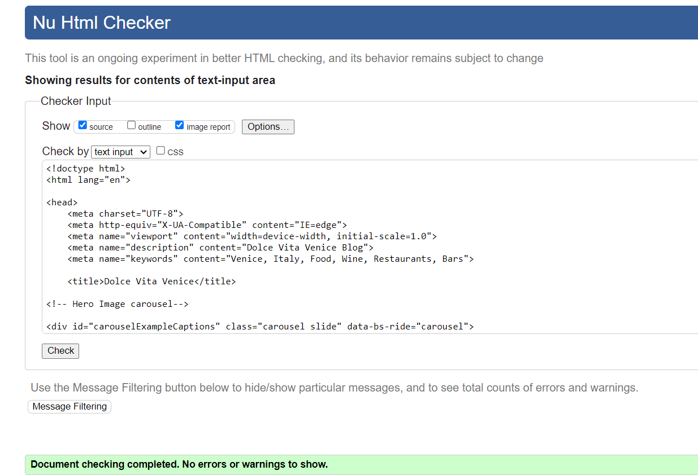

- post_detail.html
  
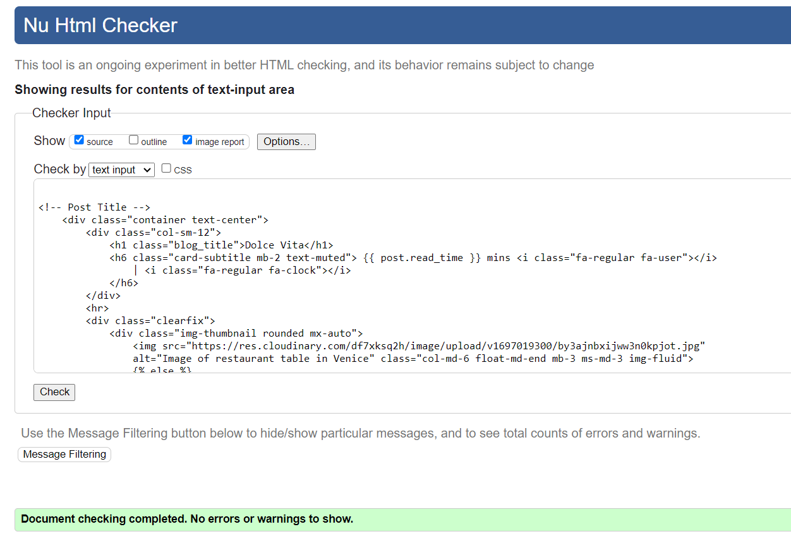

- category.html

- add_post.html

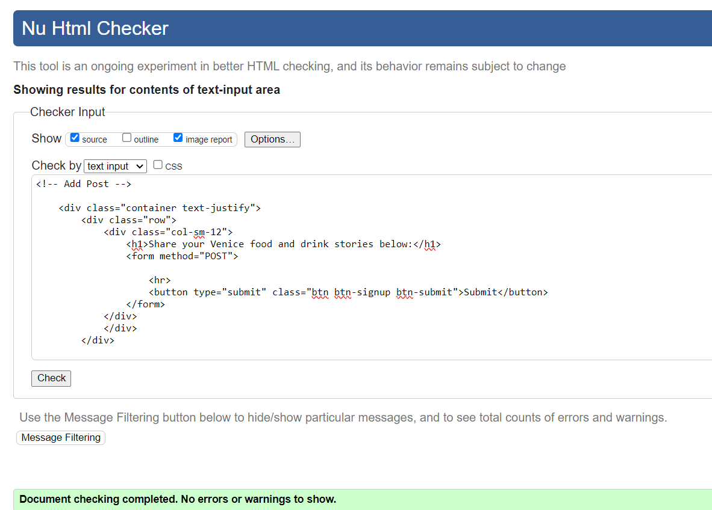

- comment_delete.html

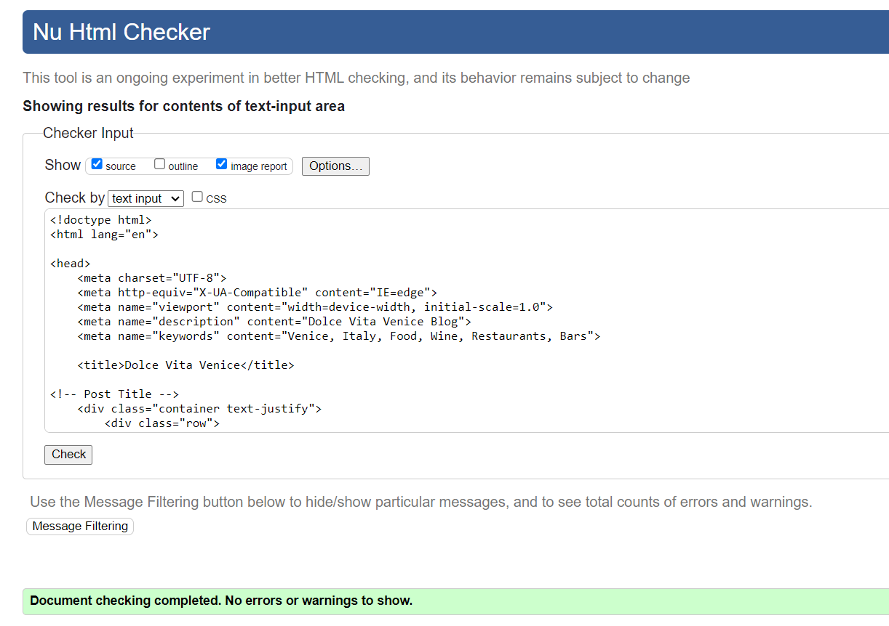

- comment_edit.html

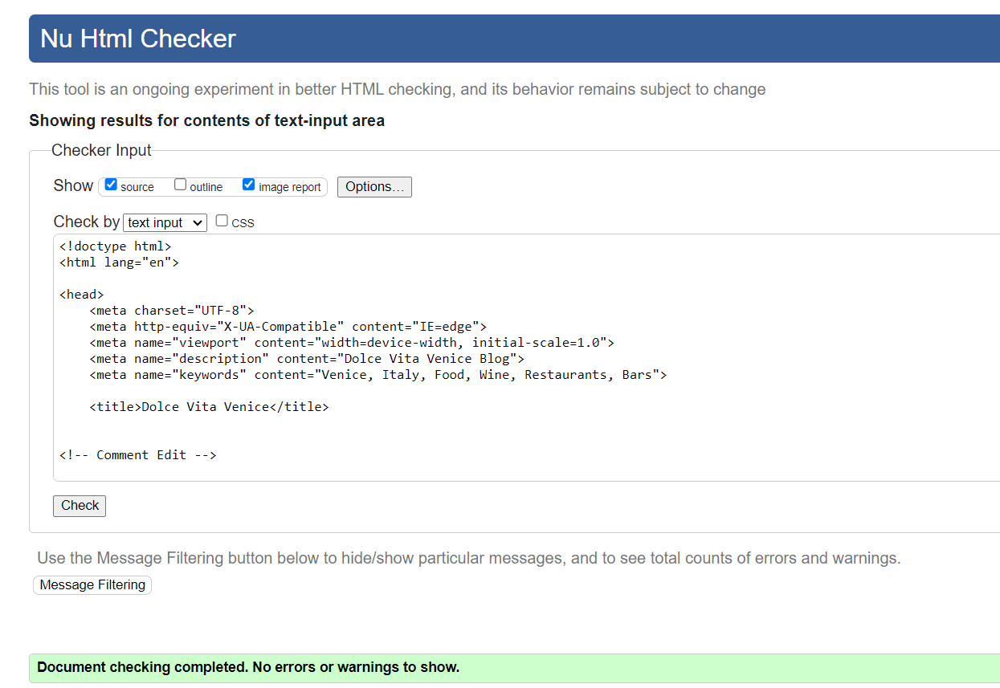

- about.html


- post_delete.html


- post_edit.html


- register.html


- signup.html


- logout.html


#### W3C CSS Validator

[W3C CSS Validator](https://jigsaw.w3.org/css-validator/)

Screenshot of W3C Validator test, style.css passed


#### JSHint

- JSHint results
  


#### PEP8 Online

- Python checker PEP8

    - models.py


    - views.py


    - forms.py


    - test_models.py


    - test_views.py


    - test_forms.py


#### Lighthouse

The colors and fonts chosen are easy to read and accessible by running it through lighthouse in Chrome developer tools.

- index.html


- post_detail.html


- about.html


- add_post.html


- post_delete.html


- post_edit.html


- comment_edit.html


- comment_delete.html


#### Django testing tools

Django TestCase was used to create 31 automatic tests for Python files. The test reporting tool ’Coverage’ was installed to show the percentage of Python code that’s been covered by tests.
 
See below links to the tests:

- [test_admin.py](https://github.com/estii20/dolce_vita_blog/blob/main/blog/test_admin.py)
- [test_forms.py](https://github.com/estii20/dolce_vita_blog/blob/main/blog/test_forms.py)
- [test_models.py](https://github.com/estii20/dolce_vita_blog/blob/main/blog/test_models.py)
- [test_views.py](https://github.com/estii20/dolce_vita_blog/blob/main/blog/test_views.py)


### Coverage tests

The projects tests ran successfully however the project needs further tests to increase coverage, which is crucial for maintaining code quality and reliability. Comprehensive tests ensure the stability of the codebase, catch bugs early, and support future development. This area of development needs further improvement.

### User Stories testing

To further ensure this application is working correctly and functions as expected, manual testing was also performed. User Stories were tested successfully to verify that all acceptance criteria was met.

- US1: As a Site User I can click on a post so that I can read the full text.

  - Acceptance Criteria:
        - Site User can easily click on a blog post and be directed to the full blog post in the post_detail.html page.

  - Testing result: 
      - PASS
        - When clicking on the Blog Title, or Blog Excerpt Read more link it directs the user to the full blog post.

- US2: As a Site User / Admin I can view the number of likes on each post so that I can see which is the most popular.

  - Acceptance Criteria:
        - The likes feature should fill as a solid thumbs up when clicked and show the number of likes next to it. This should be seen at the bottom of the post detail page, and also on the blog card in index.html so that site user and admin can see instantly if it is an interesting post.

  - Testing result: 
      - PASS
        - When viewing the homepage the site user can see at the bottom of the blog card the number of likes for the post and also at the bottom of the full blog post.

- US3: As a Site User I can view a list of posts so that I can select one to read.

  - Acceptance Criteria:
        - The most recent six posts should be presented to the site user on the homepage, page pagination is available to explore the full list of posts.

  - Testing result: 
      - PASS
        - When viewing the homepage the site user can view up to six posts per page so that its possible to choose a blog post to view in full.

- US4: As a Site Admin I can create draft posts so that I can finish writing the content later.

  - Acceptance Criteria:
        - The admin interface for the blog project should save the blog post in draft form which can then be reviewed at a later date.

  - Testing result: 
    - PASS
        - In the site admin panel it is possible write, save and later review the blog post, so that it can be published when complete.

- US5: As a Site Admin I can approve or disapprove comments so that I can filter out unacceptable comments.

  - Acceptance Criteria:
        - The admin interface for the blog project it should be possible to read and then publish a suitable comment so that it can be seen on the blog site in connection with the blog post.

  - Testing result: 
    - PASS
        - In the site admin a list of comments can be viewed and chosen to be published if suitable.

- US6: As a Site Admin I can create, read, update and delete posts so that I can manage my blog content.

  - Acceptance Criteria:
        - The admin interface for the blog project it should be possible to create blog posts, save blog posts in draft form, Edit blog posts and delete blog posts.

  - Testing result: 
    - PASS
        - In the site admin interface, the site admin can create posts, save drafts of posts, edit posts and delete posts.

- US7: As a Site User / Admin I can view comments on an individual post so that I can read the conversation.

  - Acceptance Criteria:
        - The blog site should show the comments underneath the blog post, the most recent comment is first.

  - Testing result: 
    - PASS
        - The blog detail page shows the approved comments underneath the blog post with the most recent comment at the top.

- US8: As a Site User I can register for an account so that I can comment and like.

  - Acceptance Criteria:
        - The blog site should offer the site user the option to complete a registeration form, to have full access to the blog like and comment features.

  - Testing result: 
    - PASS
        - The homepage navbar has a register link when users are not logged-in which allows new users the option to register their name and password. Once completed the user can access all the like and comment features of the blog. There is also a register link in the footer if a user is not logged in.

- US9: As a Site User I can leave comments on a post so that I can be involved in the conversation.

  - Acceptance Criteria:
        - Once a user is logged in it should be possible to complete a comment form below the blog post.

  - Testing result: 
    - PASS
        - The blog post page shows a comment form once the user is logged in, so that it is possible to add a comment to be reviewed and published by the site admin.

- US10: As a Site User I can edit a post so that I can update my blog post.

  - Acceptance Criteria:
        - Once a user is logged in and authenticated as the post author, it should be possible to edit their blog post.

  - Testing result: 
    - PASS
        - The blog post page shows an edit button if the user is logged-in and authenticated as the post author. Once the edit button is clicked it takes the user to post_edit.html page where the post can be seen and amended and finally saved and reposted to the blog site.

- US11: As a Site User I can add a post so that I can engage with the blog.

  - Acceptance Criteria:
        - The navbar should have the option to add a post if a user is registered and logged-in. Once a user is logged-in, it should be possible to add a blog post.

  - Testing result: 
    - PASS
        - The navbar has a link to add a post once the user is registered and logged in. The add_post.html form uses the sumernote widget which mirrors the form on the admin site. The user can complete the required fields, Blog Title, Excerpt, Blog Content. There are also the options to add a featured image and author biography, these are not required fields.

- US12: As a Site User I can delete a post so that I can remove invalid blog posts.

  - Acceptance Criteria:
        - The blog post should have a delete button at the bottom of the post if the user is logged-in and the post author. When selected it should take the user to the post_delete.html page so that they can confirm to delete the post.
        - The blog post is then instantly deleted.

  - Testing result: 
    - PASS
        - At the bottom of the blog post is a delete button so that a authenticated user and author can select delete post. Once selected, the user is taken to post_delete.html and it is possible to confirm that the post should be deleted. The blog post is then deleted.

- US14: As a Site User I can see and choose a category of blog post so that I can easily find relevant posts.

  - Acceptance Criteria:
        - The category of the post should be visible on the homepage so that the user can quickly identify what the post is about. The category title should link to other posts so that the user can see all the category posts as a list.
        - The site should offer users the chance to select a list of posts in a certain category so that they can find posts that interest them.

  - Testing result: 
    - PASS
        - The category for each post is shown above the blog title on the homepage. When the link is clicked which takes the site user all posts in that category.
        - The footer has a navigation list of all categories, when clicked it takes the site user to all the posts in that category.

- US15: As a Site User I can see the author bio of a blog post so that I can read about their background information.

  - Acceptance Criteria:
        - The option to the site user to add an author biography underneath their blog post. If added it should appear underneath the blog post in the post_detail.html page.

  - Testing result: 
    - PASS
        - The site user can add an author biography when adding a post and updating a post. It is not a required field. If the author has chosen to complete the author biography then it is seen at the bottom of the blog post.

- US16: As a Site User I want to be able to delete a comment so that I can remove comments from posts.

  - Acceptance Criteria:
        - The option to the site user to delete their comment if they are logged-in and the comment author. Once selected the user should be directed to the comment_delete.html page to confirm that this is the comment they wish to delete.

  - Testing result: 
    - PASS
        - The site user can see a delete comment button if they are logged-in and the comment author. Once clicked the user is taken to the comment_delete.html page to comfirm that the comment is the one to delete. Once clicked to confirm the comment is deleted.

- US17: As a Site User I want to be able to edit a comment so that I can amend typos from comments.

  - Acceptance Criteria:
        - The option to the site user to edit their comment if they are logged-in and the comment author. Once selected the user should be directed to the comment_edit.html page to confirm that this is the comment they wish to edit. The user should be able to edit the comment and submit.

  - Testing result: 
    - PASS
        - The site user can add see an edit comment button if they are logged-in and the comment author. Once clicked the user is taken to the comment_edit.html page to comfirm that the comment is the one to edit. Once edited the comment can be saved and republished.

- US18: As a Site Admin I want to be able to display an about page so that the user can know who/what the blog is for/about.

  - Acceptance Criteria:
        - There should be a link to an about page which gives some information to the user what the blog is about to better understand if the site is useful to the user.

  - Testing result: 
    - PASS
        - The site user can see an about link in the footer which when clicked takes the user to the about page. The about page gives the user information about the blog and who/what the blog is about. The about page gives the user the key reasons for the blog and what the intention of the blog is.

- US21: As a Site User I want to see success messages so that I know when an action has been taken.

  - Acceptance Criteria:
        - User action should provide feedback when they are logged-in, when they are logged-out, when a post is added/edited/deleted, when a comment is added/edited/deleted.

  - Testing result: 
    - PASS
        - The site user can see a success message when they log-in, log-out and add/delete/edit a comment/post, so that they know an action has happened successfully.

- US22: As a Site User / Admin I want to show the read time of a post so that visitors can click on posts that they have time to read.

  - Acceptance Criteria:
        - The site user should see a read time for a post so make a descision if they have time to read it in full.

  - Testing result: 
    - PASS
        - The site user can see a the read time for a post on the blog card in the homepage and also underneath the blog post title in the post_detail.html page.

- US24: As a Site User / Admin I want to be able to contact the site owner so that it is possible to offer feedback and ask for information.

  - Acceptance Criteria:
        - The site user should see contact information so that they know how to contact the site owner.

  - Testing result: 
    - PASS
        - The site user can see the blog site contact information in the footer so that they can email the blog site owner.

- US25: As a Site User/ Admin I want to be able to view posts with the most recent post featured first so that it is possible to get the latest blog post.

  - Acceptance Criteria:
        - The site user should see a list of posts in the homepage that have been created most recently.

  - Testing result: 
    - PASS
        - The site user can see a list of blog posts in the homepage, the most recent blog is listed first.

- US26: As a Site User / Admin I want to be able to see logged-in user name so that I know when I am logged into the site.

  - Acceptance Criteria:
        - The site user should see their username on the navbar if they are logged-in.

  - Testing result: 
    - PASS
        - The site user can see their username at the top-right of the navbar when they are logged-in.

### Further Testing

### Solved bugs

- Django test error - When testing my python files I had to comment out the PostgreSQL database and use the default SQLite3 database in settings.py. Thanks to Code Institute’s Slack Channel, this was solved.

- Heroku deployment failed at first, thanks to the Code Institute Tutor support the error in the Procfile was amended.

- Am I responsive? - I had to install the Google Chrome extension, Ignore X-Frame headers to generate mockup images using Am I responsive. Thanks to Code Institute’s Slack Channel, this was solved.

- Responsiveness improved - the submit buttons and social share buttons were adjusted for small screen size so they stack on top of eachother.
  
- Improve accessibility based on Lighthouse Accessibility score - added aria labels to buttons, improved the contrast for the Author Bio background-color, improved the contrast of the update, submit, delete buttons, Changed the color of the About link for improved accessibility, footer text changed from `text-white 50` to `text-white`, improved semantics of card heading elements from a `h6` heading to a `h2` heading.
  
- Success messages not working in delete comment and delete post, as SucessMessageMixin not available for this view. Therefore Added a delete function to handle this instead and return to homepage with reverse lazy home as the view.
  
- Unpublished posts were listing in category.html. Thereofre I added an `if post.status == 1` to category.html so only published posts are listed in the category view.

- Pagination of category.html did not work with the statement `if paginated`, further research explained that it was necessary to import dajngo.core Paginator to the views.py and update the CategoryView model to include Paginator, PaginatorNotAnInteger and EmptyPage to create a list of category posts paginated by 6 per page.

- To improve page load added `loading=lazy` to images to tell the browser to prioritise the loading of images that are within the user's viewport and delay the loading of images that are further down the page and not immediately visible. Also, I changed all site images to webp files for better site performance. WebP images have significantly smaller file sizes compared to JPEGs while maintaining similar image quality. This results in faster loading times for web pages and reduces bandwidth usage. The blog post images used were then compressed using squoosh to reduce the file size even further.

- The use of the defer attribute which tells the browser to defer the execution of the script until the HTML parsing is complete. This was added to script tags to improve page load performance as it allows the HTML parsing to continue without waiting for the script to download and execute.

### Unresolved bugs

None

## Deployment

To access this project in GitHub;

1. Firstly Log into [Github](https://github.com/).

2. Select repository [estii20/dolce_vita_blog](https://github.com/estii20/dolce_vita_blog).

1. Select settings from menu.

2. Select Pages from left menu bar.

3. Scroll and select Master branch from the drop down menu to deploy the website.

4. Retrieve the automatically generated link from the GitHub pages section.

Deployment to Heroku:

- Login to [Heroku](https://dashboard.heroku.com/apps)
- Create new app.
- Choose a unique name for your applicationand enter your location.
- Click on Create app.
- Go to the Settings tab => click on Reveal Config Vars.
- Copy the DATABASE_URL url value to the clipboard.
- In IDE Create a new env.py file on top level directory.
- Add an env.py file:
  - Set environment variables: os.environ[”DATABASE_URL"] = "Paste in Heroku DATABASE_URL Link”
  - Add in secret key: os.environ[”SECRET_KEY"] = "Make up your own randomSecretKey”
- In Heroku - Go to the Settings tab => click on Reveal Config Vars.
- Add SECRET_KEY to Config Vars with the randomSecretKey value previously chosen.
- In the settings.py file:
  - Remove the unsecure secret key and replace it with: SECRET_KEY = os.environ.get(’SECRET_KEY')
  - Update to use the DATABASE_URL: dj_database_url.parse(os.environ.get(”DATABASE_URL"))
- Save all files and Make Migrations: python3 manage.py migrate
- Login to [Cloudinary](https://cloudinary.com/) and navigate to the Cloudinary Dashboard.
- Copy your CLOUDINARY_URL API Environment Variable to the clipboard.
- In the env.py file:
  - Add Cloudinary URL: os.environ["CLOUDINARY_URL"] = ”cloudinary://paste in API Environment Variable”
- In Heroku => Navigate to the Settings tab, click on Reveal Config Vars.
- Add ’CLOUDINARY_URL’ to Config Vars with the in API Environment Variable value.
- Add ’DISABLE_COLLECTSTATIC’ 1 to Heroku Config Vars (temporary, must be removed before final deployment).
- In the settings.py file:
  - Add Cloudinary Libraries to installed apps (note: order is important) ’cloudinary_storage',  ’django.contrib.staticfiles', ’cloudinary',
  - Add the following code below STATIC_URL = ’/static/' to use Cloudinary to store media and static files:
    - STATICFILES_STORAGE = ’cloudinary_storage.storage.StaticHashedCloudinaryStorage'
    - STATICFILES_DIRS = [os.path.join(BASE_DIR, ’static')]
    - STATIC_ROOT = os.path.join(BASE_DIR, ’staticfiles')
    - MEDIA_URL = '/media/'
    - DEFAULT_FILE_STORAGE = 'cloudinary_storage.storage.MediaCloudinaryStorage'
  - Link file to the templates directory in Heroku: TEMPLATES_DIR = os.path.join(BASE_DIR, ’templates')
  - Change the templates directory to: TEMPLATES_DIR: 'DIRS': [TEMPLATES_DIR],
  - Add Heroku Hostname to ALLOWED_HOSTS: ALLOWED_HOSTS = [”Your_Project_name.herokuapp.com”, ”localhost”]
- Create 3 new folders on top level directory: media, static, templates
- Create a Procfile on the top level directory
- In the Procfile file:
  - Add the following code with your project name: web: gunicorn PROJ_NAME.wsgi
- In the terminal: Add, Commit and Push.
- In Heroku go to the Deploy tab, click on Deploy Branch.
- When build process is finished click on Open App to visit the live site.

## Pre-deployment

When you are ready to move to production, the following steps must be taken to ensure your site works correctly and is secure.
In CodeAnywhere:
- Set DEBUG flag to False in settings.py
- Check the following line exists in settings.py to enable Summernote to work on the deployed environment (CORS security feature): 
- X_FRAME_OPTIONS = 'SAMEORIGIN'
- Update the requirements.txt file with all necessary supporting files by entering the command : pip freeze > requirements.txt
- Commit and push code to GitHub In the Heroku App:
- Settings > Config Vars : Delete environment variable : DISABLE_COLLECTSTATIC
- Deploy : Click on deploy branch

## Credits

__Content__

Content information researched at:
[Venice Travel Tips](https://devourtours.com/blog/visit-italy/venice-travel-tips/) and 
[Hotel Blog Post Ideas](https://hotelblogpostideas.com/)

[Quote](https://amindfultravellerblog.wordpress.com/2018/05/06/5-italian-phrases/#:~:text=Chi%20viaggia%20vive%20due%20volte,Those%20who%20travel%20live%20twice!)

[Blog name generator](https://www.brandcrowd.com/business-name-generator?code=25OFFSEM&gclid=CjwKCAjw69moBhBgEiwAUFCx2ARv8JJSpPUvebSc7X7321mn9VZpFilr4s2KJTCrzHoEyGUWFXvyHRoCbsEQAvD_BwE)

[Blog Post Content Chat GPT](https://chat.openai.com/auth/login)

[Ordinarycoders.com - Bootstrap Footers](https://ordinarycoders.com/blog/article/bootstrap-footers)

[Forum djangoproject.com - URL not found](https://forum.djangoproject.com/t/url-not-found/4588/3)

[Stack Overflow - Context Processors to show categories](https://stackoverflow.com/questions/72977293/how-to-show-list-of-categories-in-navbar-using-django-framework)

[Real Python - Category View](https://realpython.com/build-a-blog-from-scratch-django/)

[Docs - djangoproject.com - Using success messages](https://docs.djangoproject.com/en/3.2/ref/contrib/messages/#using-messages-in-views-and-templates)

[legionscript.medium.com - Add, edit and delete posts and comments](https://legionscript.medium.com/building-a-social-media-site-with-python-and-django-part-4-edit-delete-posts-add-comments-8e6ca1ef0441)

[Django Testing for Beginners, Alice Campkin](https://alicecampkin.medium.com/django-testing-for-beginners-146bd285a178)

[learndjango.com - Django Testing Tutorial](https://learndjango.com/tutorials/django-testing-tutorial )

[medium.com - Class Based Views & CRUD](https://medium.com/jungletronics/a-django-blog-in-vs-code-3b6fc8eb19aa)

[finxter.com - Add Read Time to a Blog](https://blog.finxter.com/how-i-made-a-django-blog-audio-versions-of-my-blog-articles-auto-gen/)

[freecodecamp.org - CSS Shadow Effect](https://www.freecodecamp.org/news/how-to-create-beautiful-box-shadows-in-html-and-css/)

[studygyaan.com - Social Share Button](https://studygyaan.com/django/adding-a-social-share-button-to-your-django-website)

[stackoverflow.com - Summernote responsiveness](https://stackoverflow.com/questions/61657061/how-do-i-resize-the-width-of-summernote)

[stackoverflow.com - How to make a card footer stay at the bottom of a card](https://stackoverflow.com/questions/48406628/bootstrap-align-button-to-the-bottom-of-card)

[forum/djangoproject.com - How to paginate categories](https://forum.djangoproject.com/t/how-can-i-paginate-my-posts-list-in-my-homepage-blog/12961)

[stackoverflow.com - Delete view success URL](https://stackoverflow.com/questions/73396670/django-deleteview-success-url-to-previous-different-page)

[mdn web docs - Image Load Lazy](https://developer.mozilla.org/en-US/docs/Web/Performance/Lazy_loading)

[debugbear.com - Async vs Defer](https://www.debugbear.com/blog/async-vs-defer)

[Code Institute Template and Walkthrough Project - I think therefore I Blog](https://learn.codeinstitute.net/) - provided the start up project code for blog site for further extension and customisation.

__Media__

[Images](https://unsplash.com/)
- Hero Image 1 - Cristina Gottardi on Unsplash
- Hero Image 2 - Alberto Caliman on Unsplash
- Hero Image 3 - Andrea Cairone on Unsplash
- Default Featured Image - Igor Oliyarnik on Unsplash
- Image Blog Post 1 - Alberto Calina on Unsplash
- Image Blog Post 2 - Georg Regaller on Unsplash
- Image Blog Post 3 - Alana Harris on Unsplash
- Image Blog Post 4 - Jackie Park on Unsplash
- Image Blog Post 5 - Max Tutak on Unsplash
- Image Blog Post 6 - Jon Tyson on Unsplash
- Image Blog Post 7 - Victoria Shes on Unsplash
- Image Blog Post 8 - Alexandra Gov on Unsplash
- Image Blog Post 9 - Mikita Yo on Unsplash
- Image Blog Post 10 - Davey Gravy on Unsplash
- Image Blog Post 11 - Laura Kennedy on Unsplash
- Image Blog Post 12 - Daiji Umemoto on Unsplash
- Image Blog Post 13 - Chad Montano on Unsplash
- Image Blog Post 14 - Jennifer Pallian on Unsplash
- Image Blog Post 15 - Karol Chomka on Unsplash
- Image Blog Post 16 - Merve Sehirli Nasir on Unsplash
- Image Blog Post 17 - Calum Lewes on Unsplash
- Image Blog Post 18 - Klara Kulikova on Unsplash
- Image Blog Post 19 - Jorge Zapata on Unsplash
- Image Blog Post 20 - Wikisleep App on Unsplash
- Image Blog Post 21 - Eugene Zhyvchik on Unsplash
- Image Blog Post 22 - Milada Viergova on Unsplash

### Acknowledgements

Mentor - Brian Macharia, for help, feedback and always spending that bit extra time to explain things to me. Thanks so much!

Support of Code Institute Team - Deployment to Heroku assistance, thank you!

[Code Institute Slack Portfolio Project 4](code-institute-room.slack.com)
